# System Architecture - AI Traffic Control API

## Overview

The AI Traffic Control API is a distributed, microservices-based system designed to provide real-time traffic signal control recommendations using trained Reinforcement Learning (RL) models.

---

## 1. High-Level System Architecture

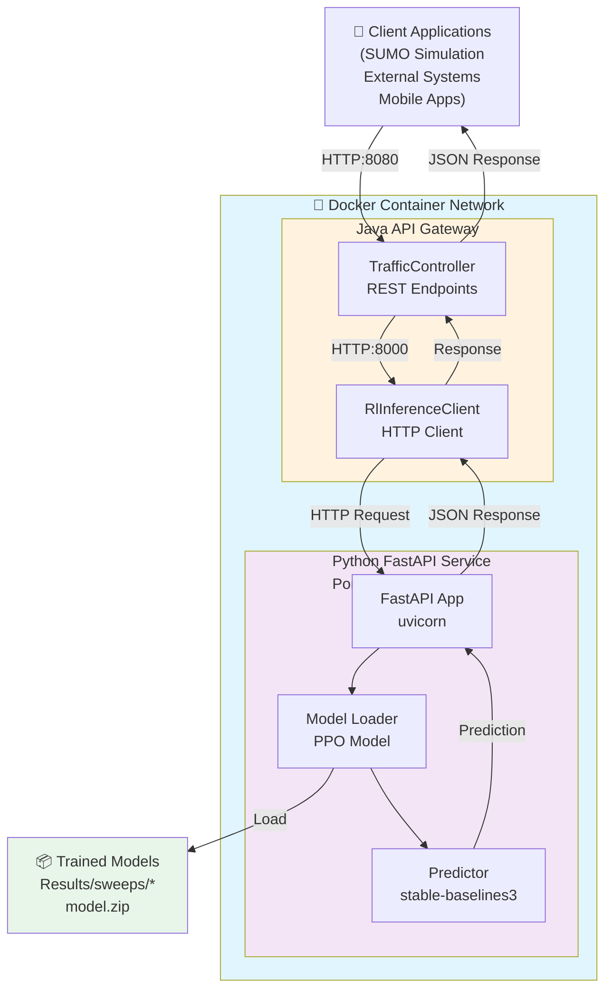

---

## 2. Request-Response Flow Diagram

### **GET /api/traffic/action** (Auto-generated observations)

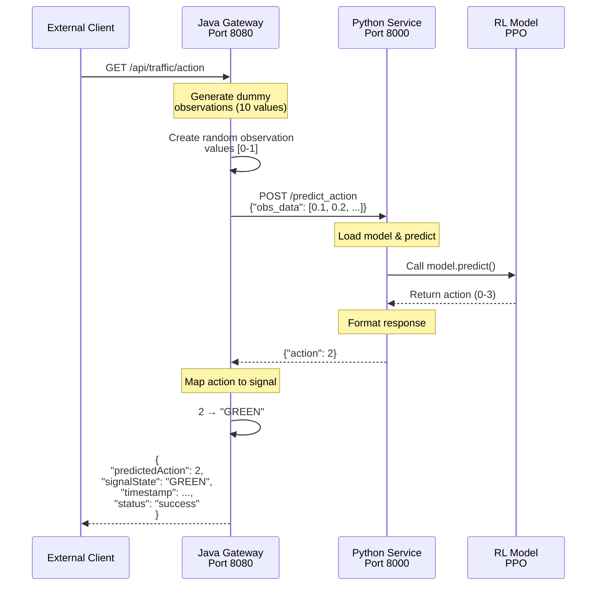

### **POST /api/traffic/action** (Custom observations)

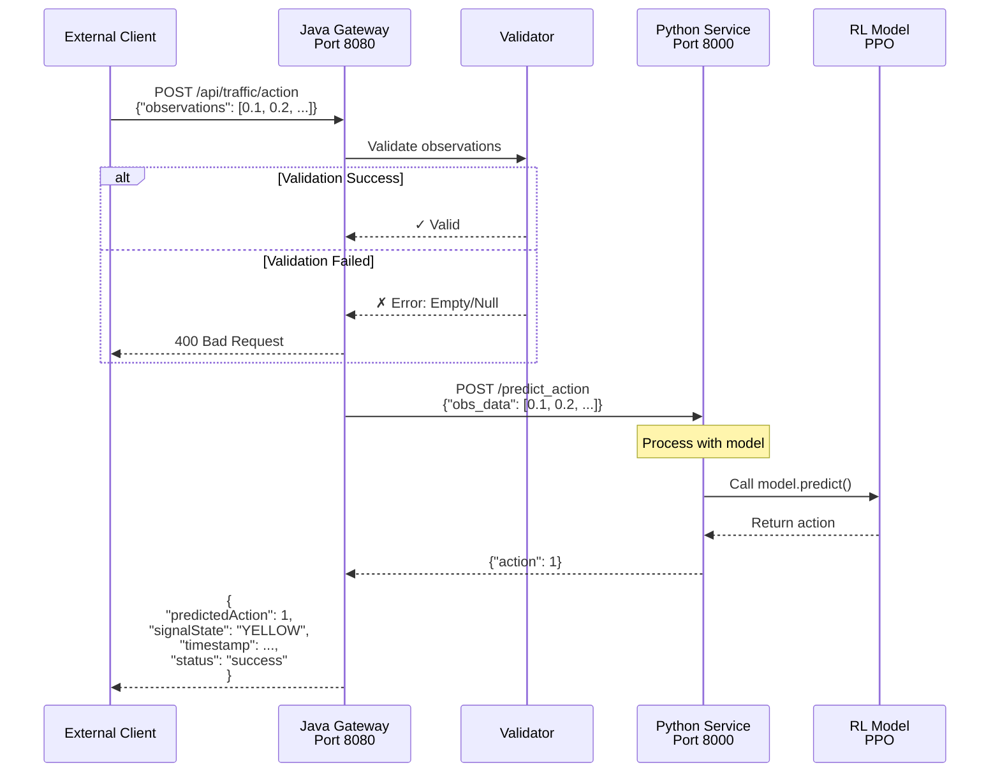

### **GET /api/traffic/health** (Health Check)

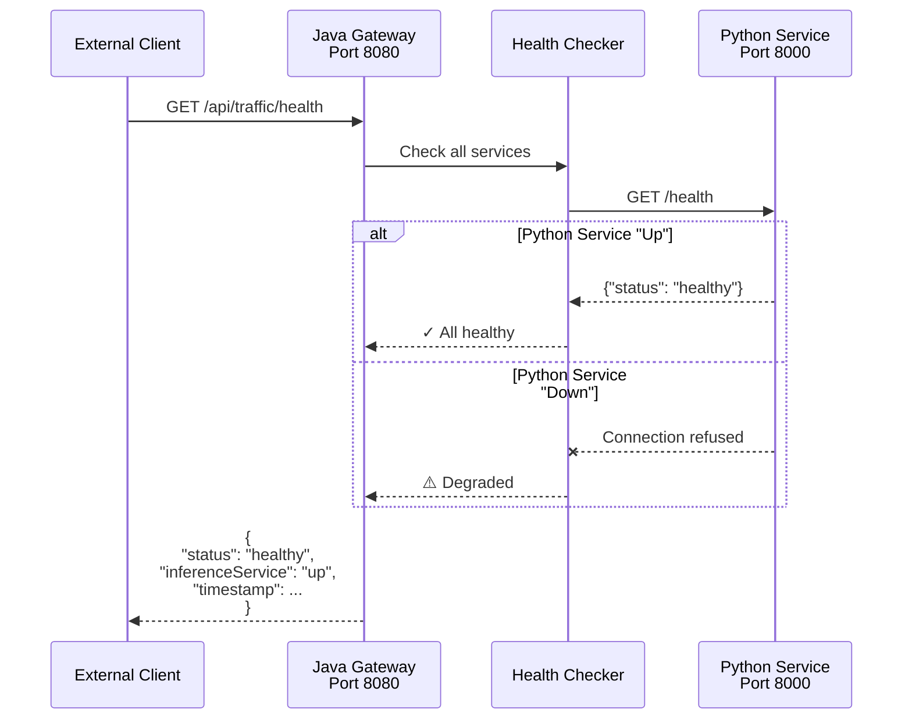

---


## 3. System Component Architecture

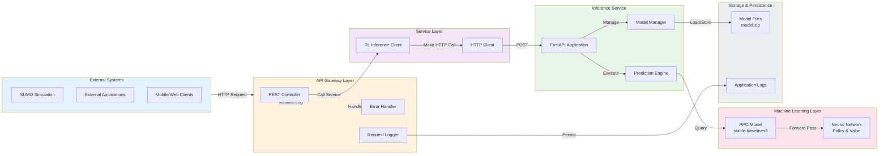

---


## 4. Data Flow Through System

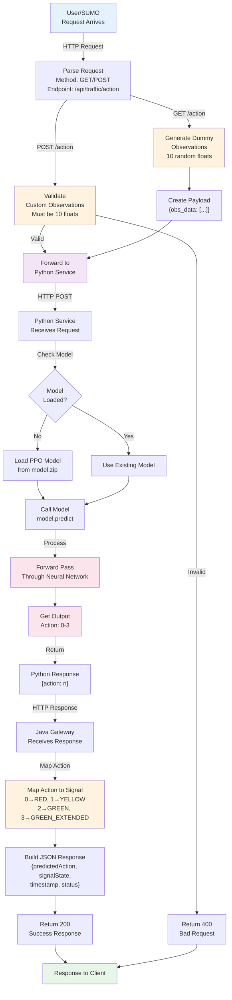

---


## 5. Deployment Architecture

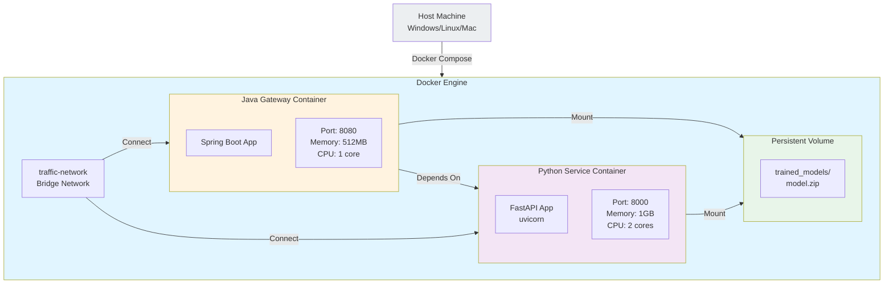

---


## 6. Detailed Internal Flow - Action Prediction

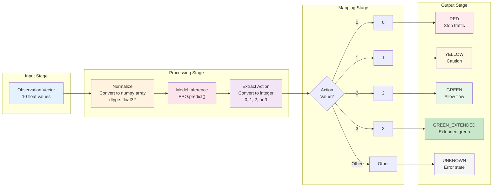

---


## 7. Error Handling Flow

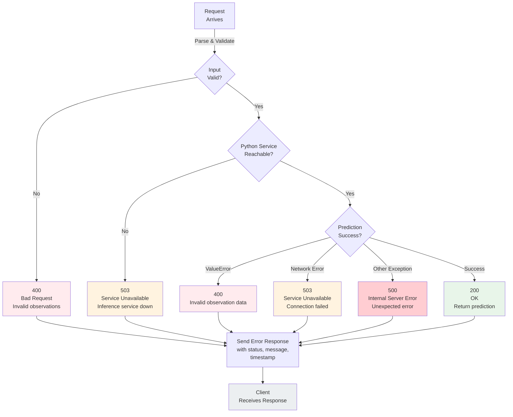

---


## 8. Inter-Service Communication Protocol

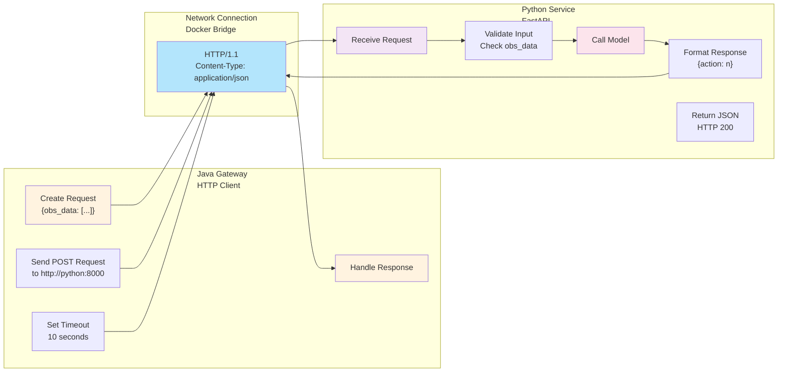

---


## 9. Model Loading & Caching Strategy

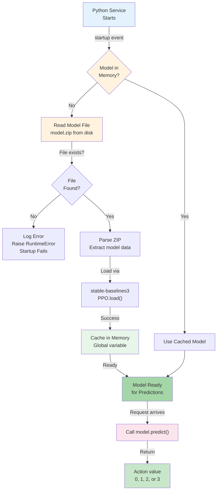

---


## 10. Complete End-to-End Workflow

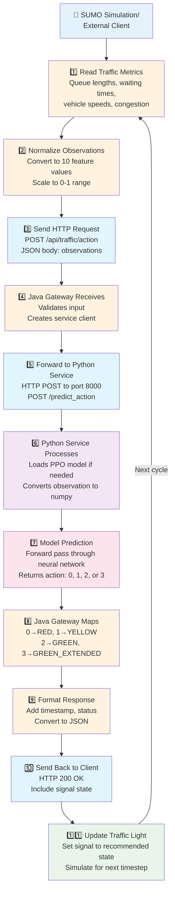

---

## 11. Architecture Decision Rationale

| Component | Choice | Rationale |
|-----------|--------|-----------|
| **Java Gateway** | Spring Boot | Enterprise-grade framework, excellent REST support, easy testing |
| **Python Service** | FastAPI | High performance, automatic API documentation, great async support |
| **ML Library** | stable-baselines3 | Industry standard for PPO, well-tested, robust |
| **Containerization** | Docker | Consistent deployment, easy scaling, isolated environments |
| **Communication** | REST/JSON | Universal, stateless, easy to monitor, language-agnostic |
| **Data Format** | JSON | Human-readable, widely supported, easy serialization |

---

## 12. Performance Characteristics

### **Latency Breakdown** (typical)

```
Total Request Time: ~100-200ms

┌─────────────────────────────────────────────────────┐
│ Total: ~150ms                                       │
├─────────────────────────────────────────────────────┤
│ ┌─────────────────────────────────────┐             │
│ │ Java Gateway: ~20ms                 │             │
│ │ - Parse request: 2ms                │             │
│ │ - Validate data: 3ms                │             │
│ │ - HTTP call: 10ms                   │             │
│ │ - Response building: 5ms            │             │
│ └─────────────────────────────────────┘             │
│ ┌─────────────────────────────────────┐             │
│ │ Network: ~10-30ms                   │             │
│ │ - Request transmission: 5ms         │             │
│ │ - Response transmission: 5ms        │             │
│ │ - Latency: 0-20ms                   │             │
│ └─────────────────────────────────────┘             │
│ ┌─────────────────────────────────────┐             │
│ │ Python Service: ~80-120ms           │             │
│ │ - Request parsing: 5ms              │             │
│ │ - Model prediction: 70-100ms        │             │
│ │ - Response formatting: 5ms          │             │
│ └─────────────────────────────────────┘             │
└─────────────────────────────────────────────────────┘
```

### **Throughput** (requests per second)

- **Single instance:** 10-50 RPS (requests per second)
- **With horizontal scaling:** Linear increase with load balancing
- **Bottleneck:** Python model inference (70-100ms per prediction)

### **Resource Usage**

| Service | CPU | Memory | Disk |
|---------|-----|--------|------|
| Java Gateway | 0.1-0.2 cores | 512 MB | 100 MB |
| Python Service | 0.5-1.0 cores | 1-2 GB | 200 MB + model size |
| Model Storage | N/A | N/A | 50-500 MB per model |

---


## 13. Scalability Considerations

### **Horizontal Scaling**

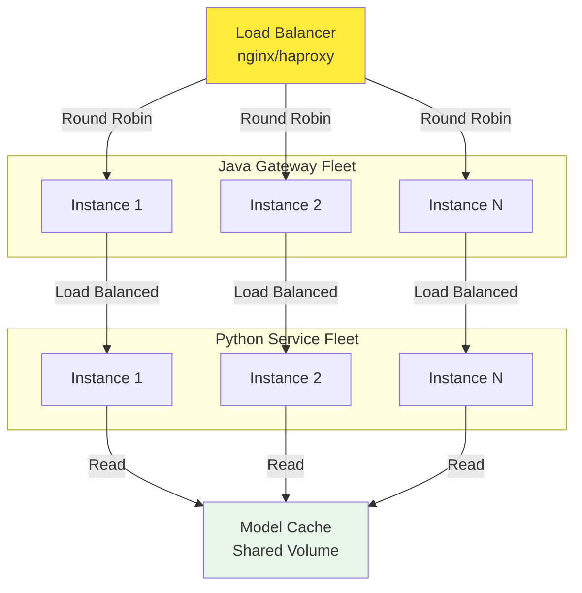

### **Vertical Scaling**

- Increase container memory (Python: 1GB → 4GB)
- Increase CPU allocation (Java: 1 core → 4 cores)
- Use GPU acceleration for Python service (CUDA-enabled Docker)

---

## 14. Security Architecture

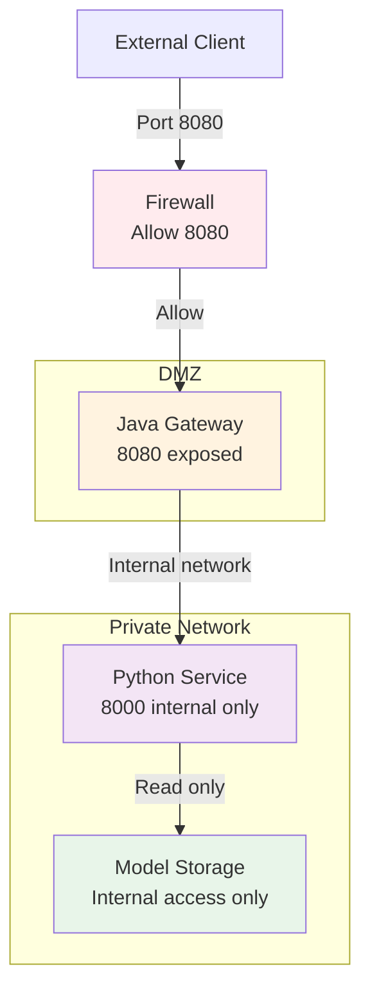

---

## 15. Monitoring & Observability Points

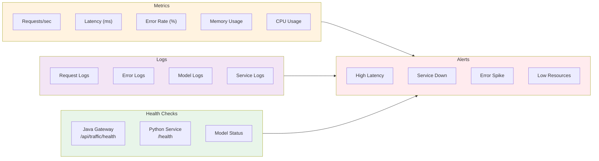

---

## 16. Deployment Patterns

### **Development**
```
Local Machine
├── Java Gateway: localhost:8080
└── Python Service: localhost:8000
```

### **Testing**
```
Docker Compose (Single Host)
├── Java Gateway Container: 8080
└── Python Service Container: 8000
```

### **Production (Cloud)**
```
Kubernetes Cluster
├── Service Mesh (Istio)
├── Load Balancer
├── Java Gateway Pods (3+)
├── Python Service Pods (2+)
├── Model Persistent Volume
└── Monitoring Stack
```

---
